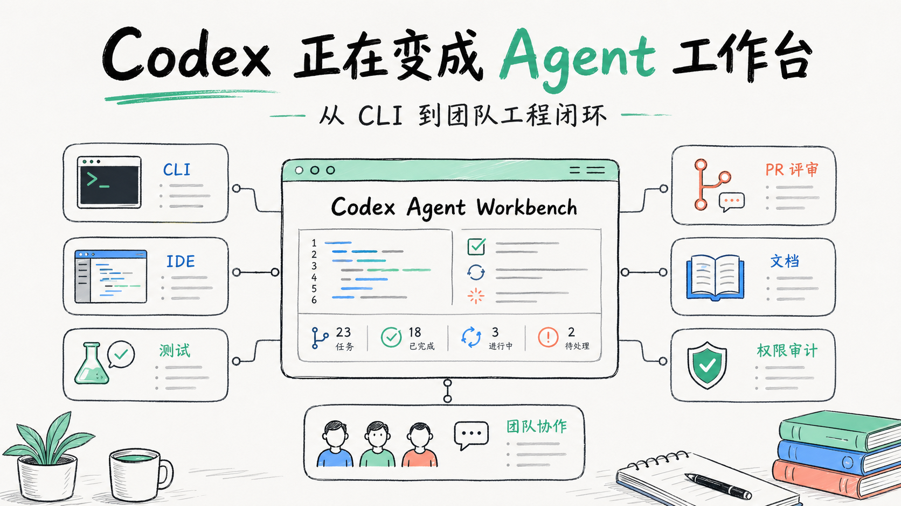
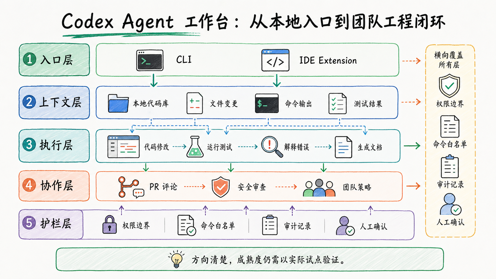
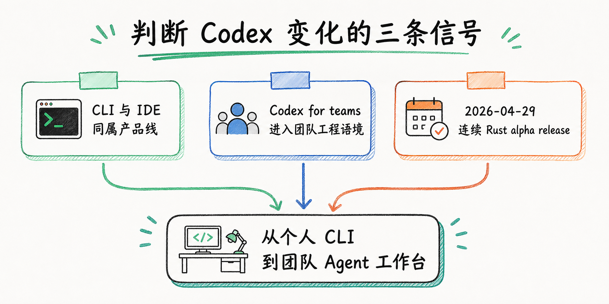
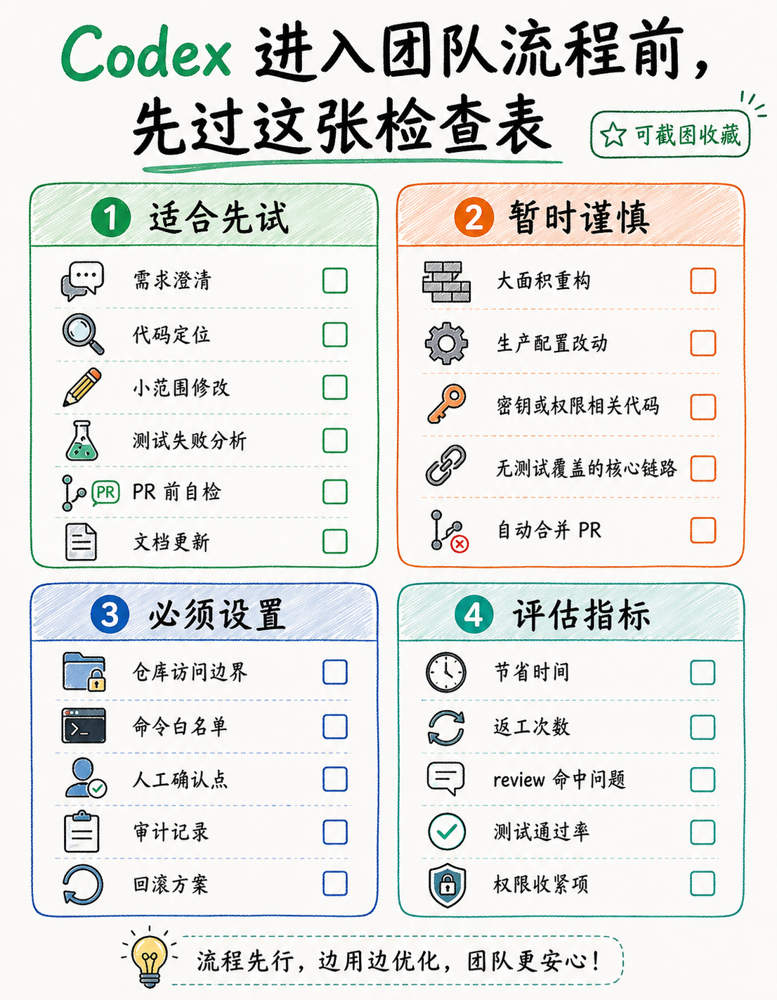

# 微信公众号发布包

## 内容定位

面向关注 AI 编程、工程效率和 Agent 工程化的技术读者。文章不是复述 Codex 更新，而是把 Codex 放到“工程团队工作台”的语境里，讨论它从 CLI 入口走向团队协作流程的产品变化。

## 核心卖点

- 视角明确：从“AI 会不会写代码”转到“AI 能不能嵌进真实工程流程”。
- 证据克制：只使用选题文件中列出的 OpenAI Codex 文档、2026-04-16 `Codex for teams` 发布页、2026-04-29 GitHub releases 信号。
- 对工程团队有用：给出适合先试的环节、权限护栏、流程护栏和记录护栏。

## 目标读者

开发者、技术负责人、工程效能负责人、正在试用 Codex/Claude Code/Gemini CLI 等 Agent 工具的小团队。

## 发布风险或待补充信息

- 人工确认：发布前复核 OpenAI 官方 Codex 文档、`Codex for teams` 页面和 GitHub releases 当前表述是否仍一致。
- 人工确认：图片中的中文文字是否清晰可读，尤其是 checklist 图。
- 文章不应写成“Codex 已经成熟替代工程团队”，目前口径是“方向清楚，适合小范围试点”。

## 标题候选

1. Codex 不是命令行玩具了：它正在变成工程团队的 Agent 工作台
2. 从 CLI 到工程闭环：Codex 正在改变 AI 编程工具的用法
3. 别只把 Codex 当代码生成器，它更像团队的 Agent 工作台
4. AI 编程工具的下一站：不是更会写代码，而是更懂工程流程

## 推荐标题

Codex 不是命令行玩具了：它正在变成工程团队的 Agent 工作台

## 摘要

Codex 的变化，不只是“又一个 AI 编程工具发版了”。更值得关注的是，它正在从个人 CLI 入口，走向覆盖本地代码、IDE、测试、PR review 和团队策略的 Agent 工作台。

## 标签

Codex、AI 编程、Agent 工程、工程效率、代码审查、AI 工具、软件工程、开发者工具

## 正文

Codex 的变化，不只是“又一个 AI 编程工具发版了”。

更重要的信号是：它正在从一个工程师在终端里临时召唤的 CLI，变成能覆盖本地代码、IDE、代码修改、测试运行、PR review 和团队策略的 Agent 工作台。

这篇文章只基于已列证据做判断：

- OpenAI 官方 Codex 文档把 CLI 与 IDE extension 放在同一产品线，并说明 Codex 可以在本地代码库中读取、修改和运行代码。
- OpenAI 在 2026-04-16 发布的 `Codex for teams` 中，把 GPT-5.5、Code Red、安全审查、PR 评论等团队工程能力放在同一叙事里。
- GitHub `openai/codex` releases 在 2026-04-29 连续发布多个 `rust-v0.126.0-alpha.*` 版本。

这些信息合在一起，指向一个更值得讨论的问题：Codex 的竞争点正在从“模型会不会写代码”，转向“能不能嵌进团队真实的软件交付流程”。

## 不是 CLI 更聪明，而是工程闭环变长了

过去我们理解 AI 编程工具，很容易卡在一个问题上：它写代码准不准？

这个问题仍然重要，但已经不够了。一个工程团队真正关心的是另一组更麻烦的问题：

- 它能不能读懂当前仓库，而不是只回答一段孤立代码？
- 它改完之后能不能跑测试，或者至少知道该跑哪些命令？
- 它能不能参与 review，而不是只在本地生成一坨 diff？
- 它有没有权限边界、审计线索和团队策略？
- 它失败时，人能不能接管，而不是被一个黑箱流程拖着走？

如果只把 Codex 当成命令行里的“写代码按钮”，会低估这次变化。CLI 只是入口，工程工作台才是目标形态。

## 三条证据指向同一个方向

第一条证据来自 OpenAI 官方 Codex 文档：Codex CLI 与 IDE extension 同属 Codex 产品线，并且可以在本地代码库中读取、修改和运行代码。

这意味着它不是一个只靠复制粘贴上下文工作的聊天窗口。它面对的是仓库、文件、命令、测试和开发者当前的工作现场。对工程师来说，这一点很关键：AI 不是在旁边“建议你怎么写”，而是开始进入实际修改代码的路径。

第二条证据来自 2026-04-16 的 OpenAI 官方发布页 `Codex for teams`。选题材料中记录，这个发布把 GPT-5.5、Code Red、安全审查、PR 评论等能力放在团队工程语境里。

这里不展开未核验的功能细节，只取一个确定信号：OpenAI 正在把 Codex 讲成团队协作工具，而不是个人效率玩具。PR 评论、安全审查、团队能力这些词，天然属于工程组织，而不是单个开发者的终端体验。

第三条证据是 GitHub `openai/codex` releases 在 2026-04-29 连续发布 `rust-v0.126.0-alpha.12` 到 `rust-v0.126.0-alpha.16`。

连续 alpha release 不等于产品已经稳定，也不能直接推导出某个能力已经成熟。但它至少说明 Codex CLI 仍处在快速迭代期。对团队采用来说，这是一把双刃剑：产品进化快，接入红利大；接口和行为也可能变，流程设计不能太死。

## 从“帮我写代码”到“帮我推进任务”

我更建议用任务链来理解 Codex，而不是用单点功能来理解它。

一个真实的工程任务通常长这样：

1. 读需求，确认要改哪里。
2. 搜索代码，找到相关模块。
3. 修改实现，补测试或调整测试。
4. 运行命令，处理报错。
5. 总结变更，发 PR。
6. 根据 review 继续改。
7. 把过程沉淀到文档、脚本或 checklist。

CLI Agent 的价值，不在于每一步都比人强，而在于它开始能跨过多个步骤。如果 Codex 能读仓库、改文件、跑命令，再叠加 IDE 和 PR review 场景，它就从“代码生成器”变成了一个能推进任务的工作台。

这也是我判断它有传播价值的原因：工程师不缺能生成函数的工具，缺的是能在真实项目里少打断、少丢上下文、少制造返工的协作者。

## 适合先放进哪些环节

不要一上来就把 Codex 放到最敏感的生产流程里。更稳的做法，是从低风险、高重复、可回滚的环节开始。

第一类是需求澄清和代码定位。让 Codex 读当前仓库，解释某个模块为什么这么设计，或者找出一条业务链路涉及哪些文件。这个阶段的风险较低，因为它主要输出理解和候选路径，人仍然做判断。

第二类是小范围修改。比如改一个配置解析、补一个边界测试、整理一段文档。任务越小，越容易 review，也越容易发现它有没有误读上下文。

第三类是测试和排障。Codex 能运行命令这一点很有想象空间，但团队要明确命令白名单、环境边界和失败处理方式。让 Agent 看测试输出并提出修复建议，比让它直接大面积改业务逻辑更稳。

第四类是 PR 前自检。让它在提交前总结改动、标出风险点、提醒缺失测试。这个环节特别适合团队，因为它能把一些“靠资深同事顺手提醒”的经验前移。

第五类是文档和迁移清单。很多工程知识不是不会写，而是没人愿意写。Agent 如果能跟着代码变更同步生成说明、升级步骤和回滚注意事项，实际价值会很高。

## 团队要先定规则，再谈效率

Codex 进入团队流程之后，最大的问题不是“它会不会写错代码”。写错代码反而是最容易处理的：测试会失败，review 能拦住，git 能回滚。

更麻烦的是边界不清。

它能读哪些目录？能不能接触密钥和生产配置？能运行哪些命令？生成的代码由谁负责？PR 评论只是建议，还是会被当成门禁？安全审查结果如何留痕？这些规则如果不提前定，团队很快会从“效率提升”滑到“责任不清”。

我的判断是：Codex 这类 Agent 工作台要进团队，至少需要三层护栏。

第一层是权限护栏。默认最小权限，明确哪些仓库、目录、命令、外部工具可以访问。尤其不要让 Agent 在没有隔离的情况下接触生产凭据。

第二层是流程护栏。Agent 可以生成 diff，但合并权仍然要在人手里；Agent 可以做 review，但不能替代代码 owner；Agent 可以跑测试，但不能绕过 CI。

第三层是记录护栏。关键任务要保留 prompt、命令、diff、测试结果和人工确认。不是为了追责好看，而是为了复盘有材料。

## 不要把“团队化”误解成“无人化”

这类工具最容易被讲成两个极端：要么是“程序员要被替代”，要么是“只是自动补全升级版”。我觉得都不准确。

更现实的变化是，工程师的工作颗粒度会变。以前你亲手在每个文件里移动，现在你更多是在定义任务、约束边界、审查结果、处理例外。你不是退出流程，而是站到更靠上的控制位。

这对资深工程师反而提出了更高要求。因为你要能判断 Agent 的修改是不是走偏了，要能把模糊需求拆成可执行任务，要能设计测试来约束它。不会拆任务的人，用 Agent 很容易得到一堆看起来努力、实际难以合并的代码。

所以我不建议把 Codex 叫作“替你写代码的人”。更准确的说法是：它正在变成一个可以被工程团队调度的 Agent 工作台。工作台的价值，取决于你把它放在什么流程里，以及给它什么边界。

## 行动建议

如果你是个人开发者，先拿一个非核心项目试 Codex CLI：让它读仓库、解释模块、做一个小修复、跑一次测试。不要只问它概念题，真正的差异出现在它接触项目上下文之后。

如果你是技术负责人，先选一个低风险场景做团队试点，例如 PR 前自检、测试失败分析、文档更新或小型重构。试点时记录三件事：节省了什么时间，制造了什么返工，哪些权限必须收紧。

如果你负责平台或工程效能，不要急着追逐“全自动开发”。更值得做的是定义 Agent 工作协议：仓库权限、命令白名单、审计日志、review 责任、失败回退。规则先跑起来，工具的升级才接得住。

最后留一个保守判断：基于当前已列证据，Codex 的方向很清楚，正在从 CLI 走向团队工程工作台；但具体能力成熟度、稳定性和团队最佳实践仍需要持续验证。今天适合关注它，适合小范围试点，还不适合把它神化成无人交付系统。

## 封面建议

- 使用：`../../posts/2026-04-30-codex-agent-workbench/assets/cover-codex-agent-workbench.png`
- 主标题：Codex 正在变成 Agent 工作台
- 副标题：从 CLI 到团队工程闭环
- 发布前人工确认：封面中文字是否清晰；如微信后台裁切导致标题被截断，优先保留“Codex / Agent 工作台 / 工程闭环”三个信息点。

## 配图建议

1. 首屏：封面图。
2. “不是 CLI 更聪明”段落后：内部架构图。
3. “三条证据”段落后：逻辑示意图。
4. “适合先放进哪些环节”后：checklist 图，适合提醒读者收藏。

## 发布前检查清单

- [ ] 人工确认 OpenAI 官方 Codex 文档当前表述。
- [ ] 人工确认 2026-04-16 `Codex for teams` 页面当前表述。
- [ ] 人工确认 2026-04-29 GitHub releases 信息仍可访问。
- [ ] 检查图片中文字是否清楚。
- [ ] 微信后台预览移动端段落间距。
- [ ] 不使用“已经替代工程团队”“无人交付已成熟”等夸张表达。
